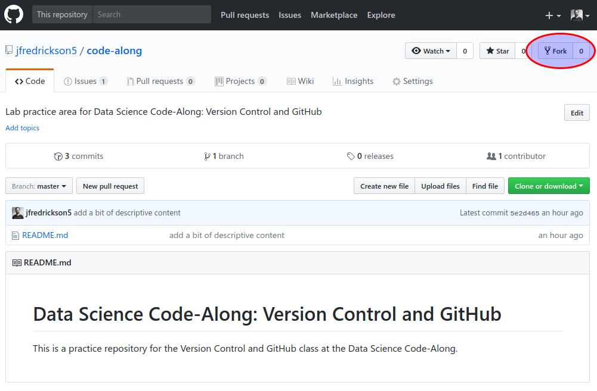

# Lab 2: Forking

## Introduction

First, what is a "fork" in GitHub parlance? A fork is basically an identical copy of an existing GitHub repository. When you create a fork, you are creating a completely new, separate repository. However, your fork still remembers where its contents originally came from, making it easy for you to share updates with the original repository if you want to.

A common approach to contributing changes to an open source project on GitHub is to fork the project's repository, make changes in your fork, and then ask the project's team to accept your changes.

In this lab, we'll focus on how to create a fork.

## Exercise 1: Fork a repository

*Throughout the exercise, make sure you are on the [jfredrickson5/code-along](https://github.com/jfredrickson5/code-along) repository (not the GSA/training-pathway-data-practitioner repository).*

1. Click the **Fork** button at the top right of the jfredrickson5/code-along repository.

2. If you've already had a GitHub account for a while and you're part of an organization such as GSA, then GitHub asks you where you want to fork the repository. Select your own account.

After a few seconds, you should have a full copy of the original code-along repository. While you didn't have permission to make changes to the files in [jfredrickson5/code-along](https://github.com/jfredrickson5/code-along), you have full access to your own fork.

## Exercise 2: Review your fork

1. Look at the title of your newly created repository. It should say `your_username/code-along`, and below that, it should say "forked from [jfredrickson5/code-along](https://github.com/jfredrickson5/code-along)". This is how you know your repository is a fork.

2. Look at the top of your repository's file list. There will be a message saying "This branch is even with jfredrickson5:master." This means your repository is currently an identical copy of the original repository.

3. Notice that the **Issues** tab is missing on your fork. GitHub automatically removes the Issues feature when you fork. The idea behind forks is that they are a place for you to do work before contributing your work back to the original repository. Therefore, issues should be centrally tracked in the original repository. 

4. Return to the original repository, [jfredrickson5/code-along](https://github.com/jfredrickson5/code-along). You can see that the issue you opened is still there.

## Takeaways

* You can fork any public repository, even without permission from the owner. Part of open source collaboration is to be able to copy a project's code, work on the code without interfering with that project, and be able to contribute your work back to the project if you want to do so.

* Forks are assumed to be a workspace for you to experiment and make changes to a project's code before you contribute your changes back to the project. This is why forks do not have the Issues feature by default, but rather expect you to open issues in the original repository. You can restore the Issues feature to your fork if you desire. We won't do that right now, but it's good to know the option is there.

-----

[Return to the list of labs](/codealong-version-control)
