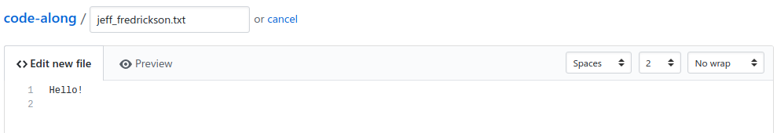
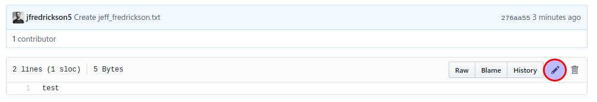

# Lab 3: Commits

## Introduction

In Git, a commit is a set of changes to any number of files. Each commit has a log message that (hopefully) concisely describes what changes were made in the commit. Typically, a commit represents a single change or a group of interrelated changes. In this lab, we will simply make a change to one file at a time.

## Exercise 1: Create a file

*Throughout the exercise, make sure you are on your newly forked repository under your own username (not the jfredrickson5/code-along or GSA/training-pathway-data-practitioner repositories). If you need to find your newly forked repository, click on the GitHub logo at the top of the page and find the box listing "Your repositories" and click **Forks**.*

1. Click the **Create new file** button on your repository's page.

2. In the **Name your file...** field, enter a file name based on your name, like: `firstname_lastname.txt`. See the screenshot below for an example.

3. In the **Edit new file** text area, enter any content you'd like in your new file. See the screenshot below for an example.

4. Scroll down to the **Commit new file** form.

5. In the commit log message box, the default commit message is `Create firstname_lastname.txt` or similar. You can leave this as is or enter something more descriptive.

6. Click the **Commit new file** button.

You should now see your new file listed in your repository. Also, at the top of the repository file listing, you'll see a message saying something like "This branch is 1 commit ahead of jfredrickson5:master." This means your fork has some content that the original repository doesn't have (not yet, at least).

## Exercise 2: Change a file

*Throughout the exercise, make sure you are on your newly forked repository under your own username (not the jfredrickson5/code-along or GSA/training-pathway-data-practitioner repositories). If you need to find your newly forked repository, click on the GitHub logo at the top of the page and find the box listing "Your repositories" and click **Forks**.*

1. In your repository, click the file name you just created. You should now see the contents of your file.

2. Click the edit button (the button is a pencil icon; see the screenshot below).

3. Make some changes to the content of the file.

4. Scroll down to the **Commit changes** form.

5. In the commit log message box, the default commit message is `Update firstname_lastname.txt` or similar. In this case, just having a generic "update" message isn't a good practice. You should enter something a bit more descriptive, but keep it short.

6. Click the **Commit changes** button.

At the top of the repository file listing, you'll now see "This branch is 2 commits ahead of jfredrickson5:master."

## Takeaways

* Even if you didn't have access to create and edit files in the original repository, you have full access in your fork.

* Every commit has a message associated with it. It's important to make sure your commit message gives some hint about the significance of the changes you're making. This helps others (and you, when you look back at your commit log later on) understand what changes each commit consists of.

-----

[Return to the list of labs](/codealong-version-control)
