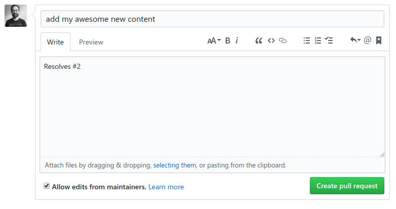

# Lab 4: Pull requests

## Introduction

A pull request (PR) is how you ask the maintainers of a repository to accept your changes into their repository.

In this lab, we'll use a PR to request that your new file be added to the [jfredrickson5/code-along](https://github.com/jfredrickson5/code-along) repository.

## Exercise 1: Open a pull request

*Throughout the exercise, make sure you are on your newly forked repository under your own username (not the jfredrickson5/code-along or GSA/training-pathway-data-practitioner repositories). If you need to find your newly forked repository, click on the GitHub logo at the top of the page and find the box listing "Your repositories" and click **Forks**.*

1. Click the **New pull request** button above your repository's file list. This will bring up a "Comparing changes" page.

2. Click the **Create pull request** button.

3. In the log message field, enter a brief summary of your pull request. See screenshot below for an example.

4. In the comment text area, enter the text `Resolves #X` where X is your issue number from Lab 1. Don't remember your issue number? Look at the [issues in the original repository](https://github.com/jfredrickson5/code-along/issues) and find the one you opened. See screenshot below for an example.

5. Click the **Create pull request** button.

[Now you'll see your pull request listed in the original repository](https://github.com/jfredrickson5/code-along/pulls). All you have to do now is wait for the original repository's maintainer to review your PR. If all looks well, they'll accept your PR and your change will now be added to the original repository.

As a bonus, because you typed `Resolves #X` with your issue number in your PR, when the maintainer accepts your PR, it'll automatically close the issue!

## Takeaways

* Asking an open source project's maintainer to accept your proposed changes is as easy as opening a PR from your fork.

* If your PR fixes an issue, you can write `Resolves #X` in the PR comments (where X is the issue number). This way, if the maintainer accepts your PR, GitHub can automatically close the issue that your PR resolves. [Read more about how this works](https://help.github.com/articles/closing-issues-using-keywords/).

-----

[Return to the list of labs](/codealong-version-control)
